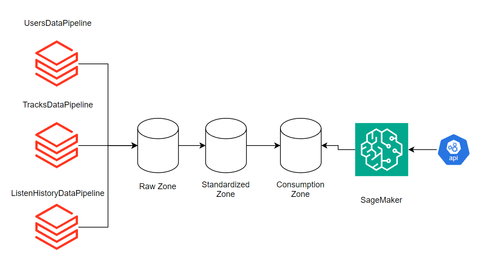
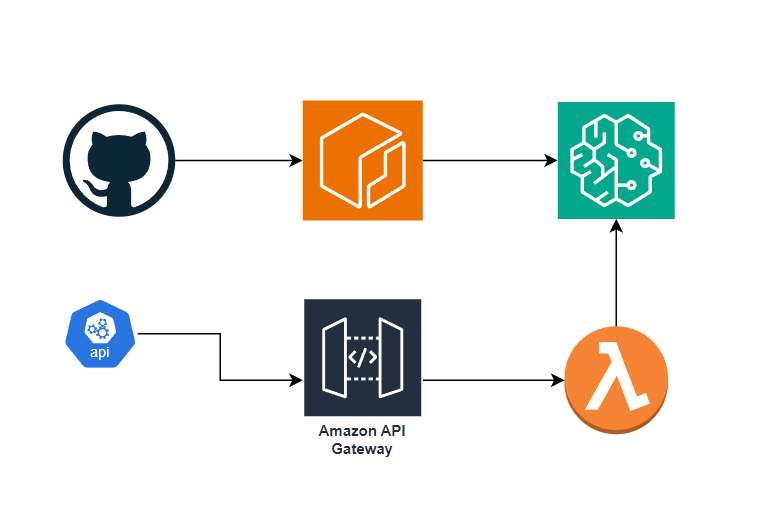

# Réponses du test

## _Utilisation de la solution (étape 1 à 3)_

Pour rouler le code, d'abord activer votre environnement virtuel. Puis, installer les packages:
```
pip install -r requiements.txt
```

Ensuite, lancer l'API en local.  Déplacez-vous dans le dossier src/moovitamix_fastapi puis exécuter la commande 

```
python -m uvicorn main:app
```
.
Puis, déplacer-vous dans le dossier src/data_pipeline, et rouler la commande:
```
python -m main.py
```

À partir du terminal, il est possible d'obtenir l'erreur suivante:

```
ModuleNotFoundError: No module named 'src'
```

Pour corriger cela, il suffit d'ajouter le path du project au path Python:
```
set PYTHONPATH="${PYTHONPATH}:/path/to/your/project/"
```

Plus facilement, est de lancer le code à partir de Pycharm!

### Architecture cloud

Le diagramme suivant montre l'architecture suggérée. Je recommende de déployer les 3 pipelines de façon séparés dans un environnement Databricks.
La raison de déployer les pipelines séparémment est le fait de ne pas être contraint par une autre source que celle qui est en cours d'exécution. En effet, s'il y a un problème quelconque avec le endpoint pour les Users, les 2 autres pipelines ne seront pas affectés lors de leur exécution.

De plus, cela permet d'ajuster la taille des machines selon la taille des requêtes pour chacun des endpoints. Cela permet aussi d'ajuster l'horaire de chacun des pipelines séparément.

Finalement, je conseille de déployer le tout dans Databricks, car cela permet d'avoir accès à une panoplie de fonctionalités, comme les Delta Live Tables, Databricks SQL, Unity Catalog, etc.
Si Databricks n'est pas disponible pour le client, alors je recommenderais de déployer chacun des pipelines dans une fonction serverless séparée, comme AWS Lambda. 
Pour ce faire, le code du projet doit d'abord être conteneurisé dans une image Docker, puis automatiquement déployé dans AWS ECR via une Github Action. Une fois fait, chacune des fonctions Lambda peut obtenir son code à partir du script Python associé.





## Questions (étapes 4 à 7)

### Étape 4

Pour la base de données, je considère qu'un _lakehouse_ est la meilleure option.
En effet, contrairement à un serveur qui hébergerait les données, un lakehouse apporte beaucoup de flexibilité par rapport à l'écriture, tout en ayant des coût beaucoup moins élevé.

La flexibilité provient du fait qu'on peut écrire les données dans un environnement qui nous convient (DEV, QA, PROD), et dans le service cloud qui nous convient (en local également pour tester) sans avoir besoin de gérer l'infrastructure de serveurs associés. Aussi, il devient très simple pour un scientifique de données de créer de nouvelles tables à partir des tables de la zone _Raw_.
Il est aussi très simple de se connecter à ces tables à partir d'un environnement Databricks ou SnowFlake par exemple.


L'écriture des données se fera sous le format _Parquet_, et les tables serait des tables _Delta_. Ainsi, la taille des données seraient très faible, limitant les coûts. De plus, les tables Delta ont la propriété de _time-travel_, permettant d'accéder à l'historique des transactions faites dans la table.

Pour ce qui est du schéma des données, il faut d'abord dire qu'il est très simple de créer les tables Delta à partir d'un environnement Databricks.
Ainsi, on peut simplement spécifier l'emplacement des données, et le schéma de la table est généré automatique (_schema on read_). 
De même, une fois la table créée, il est possible d'ajouter des contraintes aux tables pour leur ajouter des clés primaires et des foreign keys via le Unity Catalog : [Unity Catalog Add constaint.](https://docs.databricks.com/en/sql/language-manual/sql-ref-syntax-ddl-alter-table-add-constraint.html)


Ainsi, le schéma des tables de la zone Raw:

#### Pour la table **users**:

```sql
id INTEGER PRIMARY KEY,
first_name VARCHAR,
last_name VARCHAR,
email VARCHAR,
gender VARCHAR,
favorite_genres VARCHAR,
created_at TIMESTAMP,
updated_at TIMESTAMP
```

#### Pour la table **tracks**:

```sql
id INTEGER PRIMARY KEY,
name VARCHAR,
artist VARCHAR,
songwriters VARCHAR,
duration VARCHAR,
genres VARCHAR,
album VARCHAR,
created_at TIMESTAMP,
updated_at TIMESTAMP
```


#### Pour la table **listen_history**:

```sql
user_id INTEGER,
items INTEGER[],
created_at TIMESTAMP,
updated_at TIMESTAMP
```

Pour cette dernière, on ajouterait d'abord la contraite de clé de jointure sur la table _Users_

```sql
ALTER TABLE listen_history ADD CONSTRAINT user_id_fk FOREIGN KEY(user_id) REFERENCES users 
```


Ensuite, dans la zone standardized, on voudra exploser le contenu de la colonne "items" dans une colonne appelée "track_id", qui est la liste des IDs dans chansons.
On pourra ensuite ajouter la contrainte pour relier la colonne "track_id" avec la colonne "id" de la table "tracks".
Ainsi, on aura le schéma suivant


```sql
user_id INTEGER,
items INTEGER[],
created_at TIMESTAMP,
updated_at TIMESTAMP
FOREIGN KEY user_id_fk -- clé de jointure avec la table users
FOREIGN KEY track_id_fk -- clé de jointure avec la table tracks
```

### Étape 5

Pour surveiller la santé du pipeline, il y a 2 types de métriques que l'on voudra observer.

Le premier type, qui est le plus important pour le client, est le type _KPI_ des utilisateurs. Voici quelques KPIs intéressant à surveiller:

- Nombre d'utilisateurs total
- Nouveaux utilisateurs par jour
- Taille moyenne des historiques de lecture des utilisateurs
- Nombre de chansons total

Ce sont ce types de métriques que le client va regarder pour évaluer si les sytèmes de recommendation sont efficaces.


Le deuxième type de métrique est le type KPIs d'infrastructure. Quelques métriques à surveiller sont:
- Nombre de pipeline en réussite/échec par jour/mois
- Durée moyenne de l'exécution des pipelines
- Taille du lac de données
- Taille de chacune des tables
- Coût total par jour pour l'exécution des pipelines

Ce sont ce genre de métriques qui vont permettre à l'équipe, et aussi au client, de vérifier que l'infrascture mise en place est efficace ou bien si elle nécessite des ajustements.


Pour toutes ces métriques, un outil de visualisation comme PowerBI serait recommendé. Il est facile d'utilisation, et à de nombreuses fonctionalités.


Pour l'alertage, je recommenderais d'utiliser le Unity Catalog, qui permet la configuration d'alertes sur toutes les tables et les colonnes de l'infrascture. Si Databricks n'est pas disponible, alors je recommenderais la création de fonctions serveless (par exemple Lambda dans AWS) qui ferait des tests préconfigurés sur les tables de l'infrastructure, et lancerait des alertes dans Teams en cas d'échec.

### Étape 6

Pour automatiser le calcul des recommendations, il faut d'abord donner un horaire (avec _EventBridgeScheduler_ par exemple) à chacun des data pipeline afin d'avoir toujours les données les plus récentes provenant de l'API. 

Ensuite, les tables de la Consumption Zone peuvent être automatiquement créées par une job dans Databricks, ou bien simplement avec l'aide d'une VIEW. Ces tables contiennent toutes les colonnes nécessaires afin de permettre au modèle de faire sa prédiction.

Puis, comme illustré plus bas dans l'étape 7, le modèle de recommendation créé par le data scientist doit être déployé sur un endpoint par un script.
Une fois fait, alors une autre job dans Databricks peut automatiquement prendre le modèle, faire une query sur la table contenant les informations de l'historique des utilisateurs, et populer une autre table qui contiendrait les recommendations du modèle de machine learning.

### Étape 7

Pour automatiser le réentrainement du modèle de recommandation, je recommenderais l'utilisation d'un service comme AWS SageMaker. Celui-ci permet facilement de déployer une modèle sur un endpoint, accessible par une fonction Lambda, comme illustré ci-dessous.

Afin de déployer un nouveau modèle, celui-ci doit d'abord être conteneurisé dans une image Docker, le tout pouvoir être déployé automatiquement dans AWS ECR à l'aide d'un Github Action par exemple. Dans SageMaker se trouverait une tâche qui prendrait le nouveau modèle, comparerait sa performance au meilleur modèle contenu dans le _Model Registry_,. Si le nouveau modèle est plus performant, alors c'est ce dernier qui sera automatiquement déployé sur le endpoint. L'API pourra donc avoir continuellement les meilleurs recommendations faites par le modèle.


